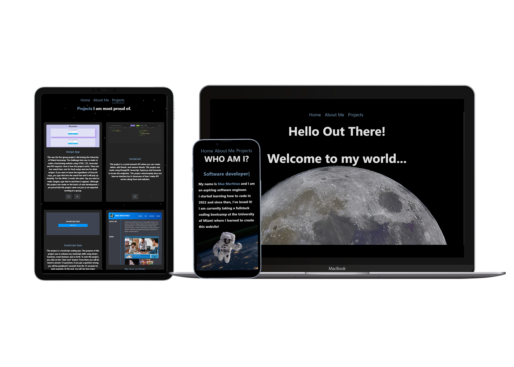

<h1 align='center'>
    Max's Portfolio Website
</h1>

<div align='center'>
    <a href='https://max-martinez-dev.vercel.app/'>My Website Here</a>
</div>



## Description

This is my professional portfolio showcasing my skills and passion for programming and innovation!

## Built With

This project was built with <b>React.js</b> and <b>Vercel</b>.

## Features

This project includes:

<ul>
    <li><h3>Multi Page Layout</h3></li>
    <li><h3>Responsiveness for different screen sizes</h3></li>
    <li><h3>Satisfying parallax scroll as well as other React.js packages</h3></li>
    <li><h3>Showcase of CSS styling and React.js functionality</h3></li>
</ul>

## Getting Started

1. Clone the repository:
```bash
git clone https://github.com/p111111111uto/max-martinez.dev.git
```
2. Install using. `npm install`.
3. Run using `npm run dev`.
4. Open the localhost in your browser.

## Questions?

Contact me at `p111111111uto` on [Github](https://github.com/p111111111uto)!
